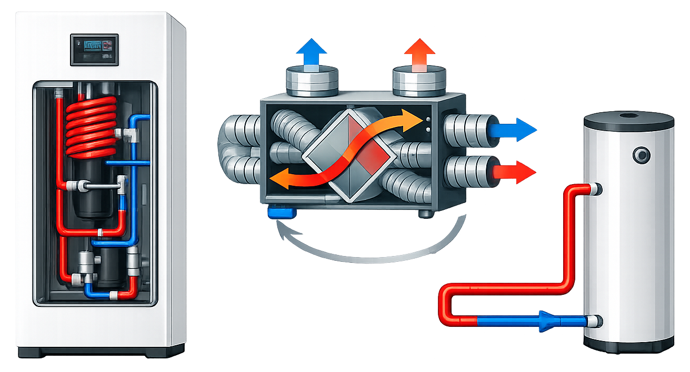
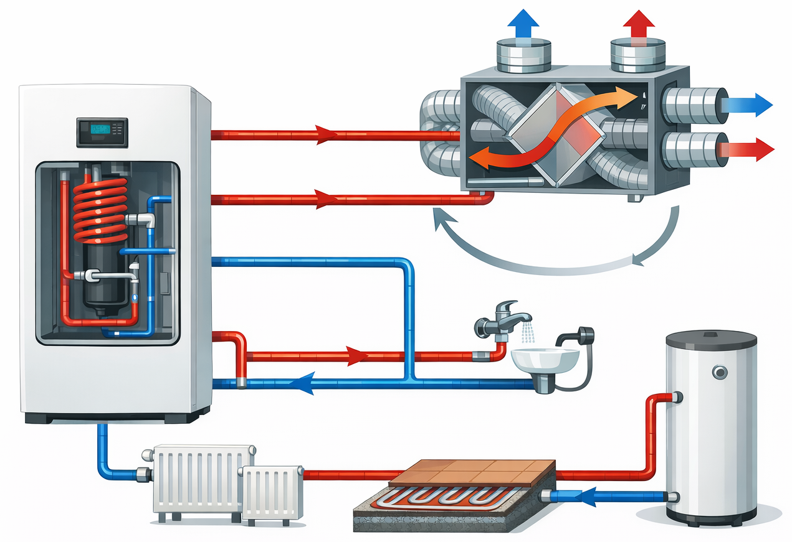
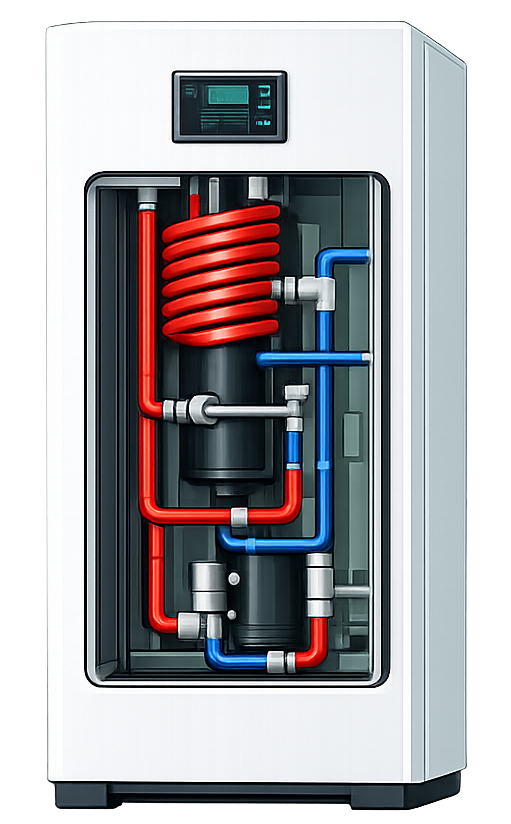
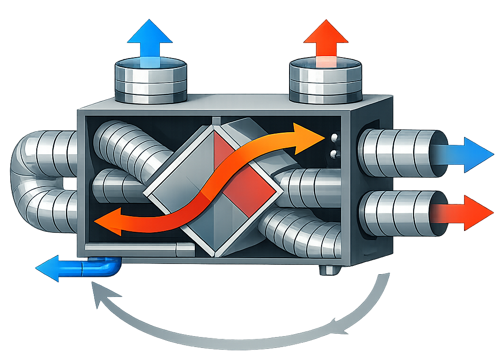
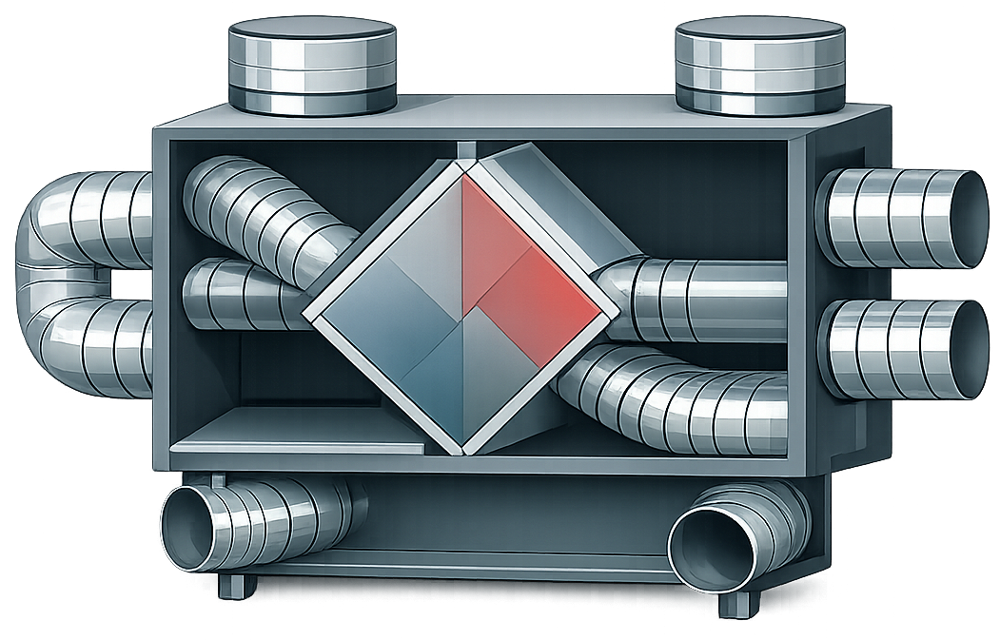
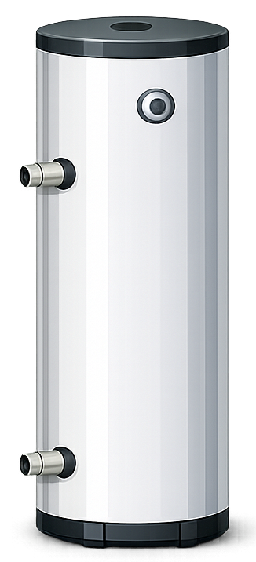
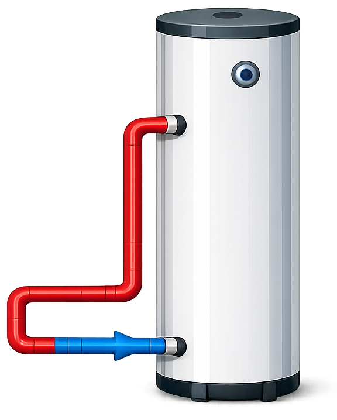

# Illustration Images

These images are optional extras created to demonstrate what you can do with **Andy Sensor Card**.

The idea is simple: place an illustration as the card background and then use **badges** (value labels, icons, status indicators, etc.) on top of it to create a very intuitive and informative visualization (e.g., a heating system overview, ventilation status, tank levels, and more).
All images below were generated with AI tools. You’re welcome to use them as-is, or create your own images to match your setup and style.

> **Tip:** Prefer the `*_transparent.png` variants if you want to overlay the illustration on your own card background.

---

## Flow diagram (transparent)

## Flow diagram (white background)

---

## Heat pump (indoor unit)

---

## Ventilation unit

## Ventilation unit (no arrows)

---

## Water boiler / hot water tank

## Water boiler / hot water tank (pipes)

