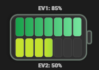
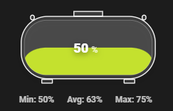

# Andy Sensor Card - v1.0.0
Welcome to my **highly configurable** Home Assistant Lovelace card that renders **advanced SVG symbols with animations** (garage doors, blinds, tanks, batteries, gates, fan/heatpump, images…) and lets you place **badges anywhere** - with actions, images and sliders and much more.

> Built for dashboards where “a simple icon + value” isn’t enough.








---

## ✨ Highlights

### Advanced symbols (built-in)
- **Garage door** (single/double) with optional **inside lamp glow**, per-door widths, gap, and independent click actions.
- **Blind** (single/double) with interior feel + optional style (persienne/lamell).
- **Gate** (sliding / door-gate) with left/right direction.
- **Tanks & levels**: tank, IBC tank, silo, water-level segments, gas cylinder.
- **Batteries**: liquid, segments, split-segments
- **Fan & Heatpump** symbols with animated fan, set blade count, set color on blades based on interval/speed, animation on high speed.
- **Image** symbol with cover/contain, optional frame, tint overlay, and dim-when-off behavior. Can be used as a background together with the badge framework.

### Interval engine (colors + behavior)
A consistent **interval framework** matched by value or number up to, drives:
- Colors / outline / gradients
- Optional per-interval icon + icon color
- Optional “matched label” and “value replacement” including variables
- Optional `seconds` per interval (used for smooth motion/animation behavior in relevant symbols)
- For Battery with segments, Water tank with segments, Garage door and blinds, interval are used to decide the amount of segments / panels. Each segment / panel with it's own color settings.

### Badges: place anything anywhere
- Use X, Y buttons to position badges freely across the card
- Multiple badge styles (solid / glass / outline / none / arrows (left,right,top,bottom), pump left, pump right, image..)
- Badge can show:
  - Icon or **image** / Image can be dimmed when off, Icon can be colored by state or changed by interval.
  - Optional **slider** (light/cover/number/input_number supported)
- Badge supports **tap actions**, including **call-service** with selected service based on domain of sensor or manual with JSON data

### Variables 
Use variables in labels, interval matched text, and badge labels:
- `<value>`, `<state>`, `<name>`, `<unit>`, `<entity_id>`, `<domain>`
- `<last_changed>`, `<last_updated>` + `_iso` and `_rel`
- `<attr:some_attribute>` to insert any entity attribute

---

## Table of contents
- [Batteries](DOCUMENTATION.md#batteries)
- [Tanks](DOCUMENTATION.md#tanks)
- [Garage Door](DOCUMENTATION.md#garage-door)
- [Blinds](DOCUMENTATION.md#blinds)
- [Fan](DOCUMENTATION.md#fan)
- [Heatpump](DOCUMENTATION.md#heatpump)
- [Image](DOCUMENTATION.md#image)
- [Badges](DOCUMENTATION.md#badges)
- [Intervals](DOCUMENTATION.md#intervals)
- [Installation](#installation)
- [Changelog](CHANGELOG.md)
- [Support me :) ](#support)


## Installation

### Option A — Install via HACS (published repository)
1. Open **HACS** in Home Assistant.
2. Go to **Frontend**.
3. Search for **Andy Sensor Card**.
4. Open the card and click **Download**.
5. Restart Home Assistant (or reload frontend resources).

After installation, the Lovelace resource is usually added automatically by HACS.  
If not, see **“Add as a resource”** below.

---

### Option B — Install via HACS (custom repository)
Use this method if the card is not yet listed in the HACS store.

1. Open **HACS** in Home Assistant.
2. Click the **⋮ (three dots)** menu in the top right.
3. Select **Custom repositories**.
4. Add the repository:
   - **Repository**: `https://github.com/maglerod/andy-sensor-card`
   - **Category**: **Lovelace**
5. Click **Add**.
6. Go to **Frontend** in HACS.
7. Search for **Andy Sensor Card**.
8. Click **Download**.
9. Restart Home Assistant (or reload frontend resources).

---

### Option C — Manual installation (no HACS)
1. Download `andy-sensor-card.js` from this repository.
2. Copy the file to your Home Assistant configuration directory: /config/www/andy-sensor-card.js

### Add as a resource (if needed)
If the card does not appear automatically:

1. Go to **Settings → Dashboards → Resources**
2. Click **Add Resource**
3. Enter:
- **URL**: `/local/andy-sensor-card.js?v=20260201-1`
- **Resource type**: `JavaScript Module`
4. Save and perform a **hard refresh** in your browser (`Ctrl+F5` / `Cmd+Shift+R`).

---

### Add the card to a dashboard

#### Using the UI editor
1. Open your dashboard → **Edit dashboard**
2. Click **Add card**
3. Search for **Andy Sensor Card**
4. Configure the card and save

## ⚡ Quick start

Minimal example (battery):
```yaml
type: custom:andy-sensor-card
entity: sensor.my_battery
symbol: battery_liquid
```


## ☕ Support the project 
I’m a Home Automation enthusiast who spends way too many late nights building custom cards, dashboards and small tools for Home Assistant.
I love creating clean, useful UI components and sharing them for free with the community, and I try to help others whenever I can with ideas, code and support.
If you enjoy my work or use any of my cards in your setup, your support means a lot and helps me keep experimenting, improving and maintaining everything.

<a href="https://www.buymeacoffee.com/AndyBonde" target="_blank">
  
</a>
